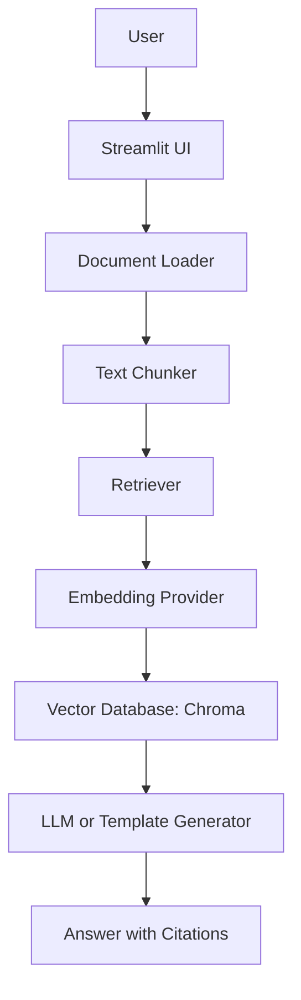
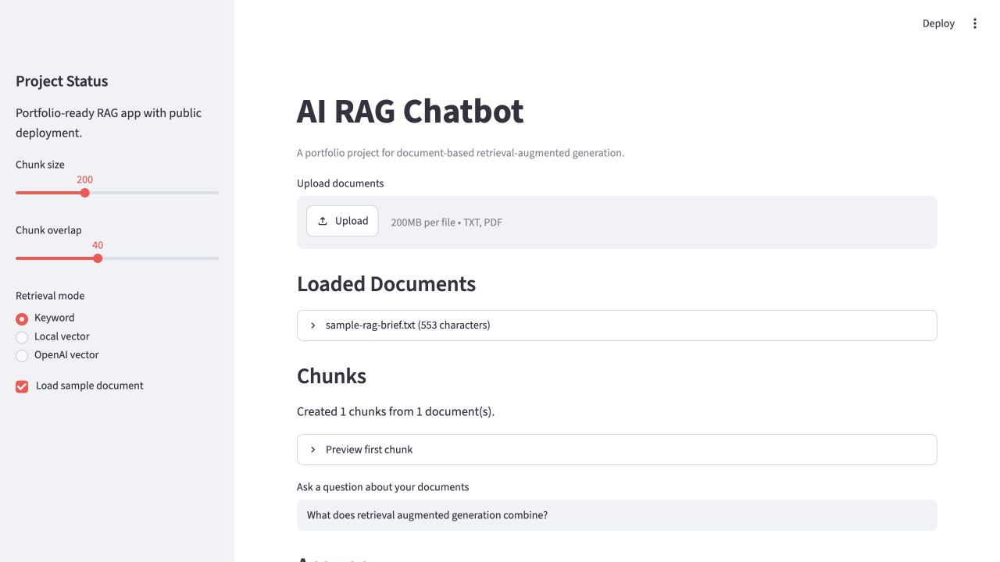
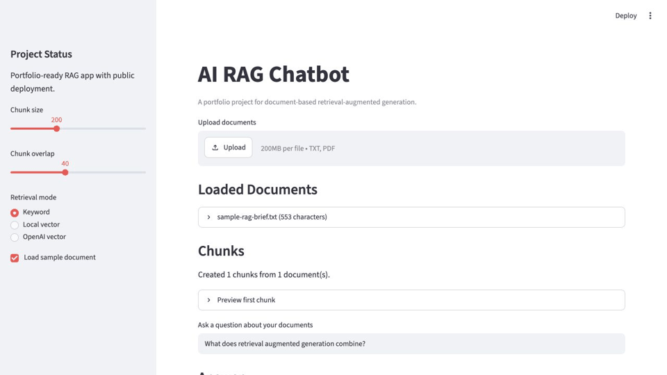

# AI RAG Chatbot

[](https://github.com/Tony-QianxiLU/ai-rag-chatbot/actions/workflows/ci.yml)
[](https://github.com/Tony-QianxiLU/ai-rag-chatbot/releases)
[](https://www.python.org/)
[](https://ry84fwqnk4abfhufqkhrmz.streamlit.app/)
[](LICENSE)

A production-minded retrieval-augmented generation (RAG) chatbot that answers questions from uploaded `.txt` and `.pdf` documents, retrieves grounded context, and returns source citations through a Streamlit interface.

This project is part of my AI engineering portfolio. It is designed to demonstrate practical GenAI application engineering: document ingestion, chunking, retrieval, vector storage, optional OpenAI integration, deterministic local fallbacks, tests, CI, deployment, and interview-ready documentation.

## Live Demo

[Open the deployed Streamlit app](https://ry84fwqnk4abfhufqkhrmz.streamlit.app/)

## Features

- Upload `.txt` and `.pdf` documents.
- Use a built-in sample document for instant demos.
- Extract and preview document text.
- Split documents into configurable overlapping chunks.
- Retrieve context with deterministic keyword search.
- Retrieve context with Chroma vector search.
- Use local deterministic hash embeddings for offline development and CI.
- Enable OpenAI embeddings when `OPENAI_API_KEY` is configured.
- Generate grounded answers with source citations.
- Fall back to template answers when no paid API key is available.
- Evaluate RAG quality with a benchmark dataset, generated reports, and CI checks.
- Run quality checks with Ruff, pytest, and GitHub Actions.
- Deploy publicly on Streamlit Community Cloud.

## Architecture



## RAG Pipeline

```text
User
  |
  v
Streamlit
  |
  v
Retriever
  |
  v
Embedding
  |
  v
Vector Database
  |
  v
LLM
  |
  v
Answer
```

## Tech Stack

- Python 3.12
- Streamlit
- LangChain
- LangChain OpenAI
- Chroma
- pypdf
- pydantic-settings
- pytest
- Ruff
- uv
- GitHub Actions

## Folder Structure

```text
ai-rag-chatbot/
|-- .github/
|   |-- ISSUE_TEMPLATE/
|   `-- workflows/
|-- data/
|   `-- evaluation_cases.jsonl
|-- docs/
|   |-- demo/
|   |-- images/
|   |-- video/
|   |-- architecture.md
|   |-- deployment.md
|   |-- evaluation.md
|   `-- walkthrough.md
|-- src/
|   `-- ai_rag_chatbot/
|       |-- app.py
|       |-- chunking.py
|       |-- config.py
|       |-- demo_data.py
|       |-- document_loader.py
|       |-- embeddings.py
|       |-- evaluate.py
|       |-- evaluation.py
|       |-- generation.py
|       |-- rag.py
|       |-- retrieval.py
|       `-- vector_store.py
|-- tests/
|-- reports/
|   `-- evaluation-report.md
|-- .env.example
|-- pyproject.toml
|-- uv.lock
`-- README.md
```

## Installation

Install `uv` if needed:

```bash
brew install uv
```

Install dependencies:

```bash
uv sync
```

## Environment Variables

Create a local `.env` file from `.env.example`:

```bash
cp .env.example .env
```

Supported variables:

| Variable | Required | Purpose |
| --- | --- | --- |
| `OPENAI_API_KEY` | No | Enables OpenAI embeddings and answer generation. |
| `OPENAI_MODEL` | No | Chat model for grounded answer generation. |
| `EMBEDDING_MODEL` | No | OpenAI embedding model. |
| `CHROMA_PERSIST_DIR` | No | Local Chroma persistence directory. |

Never commit real API keys.

## Quick Start

Run the Streamlit app:

```bash
PYTHONPATH=src uv run streamlit run src/ai_rag_chatbot/app.py
```

Run quality checks:

```bash
uv run ruff check .
uv run pytest
```

Run the RAG evaluation suite:

```bash
PYTHONPATH=src uv run rag-evaluate
```

This writes:

- `reports/evaluation-report.md`
- `reports/evaluation-report.json`

## Screenshots



Fallback screenshot:


## Demo GIF



## Walkthrough Video

[Watch the 63-second project walkthrough](docs/video/rag-chatbot-walkthrough.mp4)

## Usage

1. Open the app.
2. Keep `Load sample document` enabled for a fast demo, or upload your own `.txt` or `.pdf`.
3. Choose a retrieval mode:
   - `Keyword` for deterministic local search.
   - `Local vector` for offline vector retrieval.
   - `OpenAI vector` when an OpenAI API key is configured.
4. Ask a question about the uploaded documents.
5. Review the answer and citations.

## Example Prompts

```text
What does retrieval augmented generation combine?
```

```text
Why are citations useful in a RAG system?
```

```text
How does the app reduce hallucination risk?
```

## Example Output

```text
Relevant context was retrieved from the uploaded documents. Configure OPENAI_API_KEY
to enable LLM-generated answers.

Question: What does retrieval augmented generation combine?

Top context: Retrieval augmented generation combines search with language generation...
```

Citation:

```text
sample-rag-brief.txt | sample-rag-brief.txt:0 | score 4
```

## Evaluation

This project includes an offline RAG benchmark that can run without an OpenAI API key. It evaluates whether the app retrieves the expected source, returns citations, keeps the answer grounded in expected terms, and reports latency.

Current benchmark report:

| Metric | Result |
| --- | ---: |
| Retrieval accuracy | 100% |
| Citation coverage | 100% |
| Groundedness rate | 100% |
| Overall pass rate | 100% |

Run it locally:

```bash
PYTHONPATH=src uv run rag-evaluate
```

See [docs/evaluation.md](docs/evaluation.md) and [reports/evaluation-report.md](reports/evaluation-report.md).

## Interview Preparation

See [docs/interview-prep.md](docs/interview-prep.md) for recruiter explanations, technical questions, architecture questions, system design prompts, STAR stories, and follow-up questions.

## Technical Highlights

- Clean separation between UI, ingestion, chunking, retrieval, generation, and evaluation.
- Local deterministic embeddings make tests reproducible without paid API calls.
- Optional OpenAI components can be enabled through environment variables.
- Source references are returned as structured dataclasses, not loose strings.
- Chroma integration uses explicit replace semantics for predictable demo behavior.
- Evaluation CLI generates Markdown and JSON reports from a JSONL benchmark dataset.
- Tests cover chunking, document loading, embeddings, retrieval, generation, vector store behavior, and evaluation.

## Deployment

The public demo is deployed on Streamlit Community Cloud.

Suggested Streamlit settings:

- Repository: `Tony-QianxiLU/ai-rag-chatbot`
- Branch: `main`
- Main file path: `src/ai_rag_chatbot/app.py`
- Python version: `3.12`

Optional secrets:

```toml
OPENAI_API_KEY = "..."
OPENAI_MODEL = "gpt-4.1-mini"
EMBEDDING_MODEL = "text-embedding-3-small"
```

## Future Improvements

- Add a larger retrieval evaluation dataset with harder negative cases.
- Track precision, recall, citation quality, latency, and cost over time.
- Add persistent document collections with user sessions.
- Add hybrid retrieval and reranking.
- Add observability dashboards for retrieval and generation failures.
- Add a FastAPI backend for production deployment.

## License

This project is released under the MIT License. See [LICENSE](LICENSE).

## Acknowledgements

- Streamlit for fast AI app deployment.
- LangChain and LangChain OpenAI for LLM application primitives.
- Chroma for local vector search.
- OpenAI for optional embeddings and grounded answer generation.
