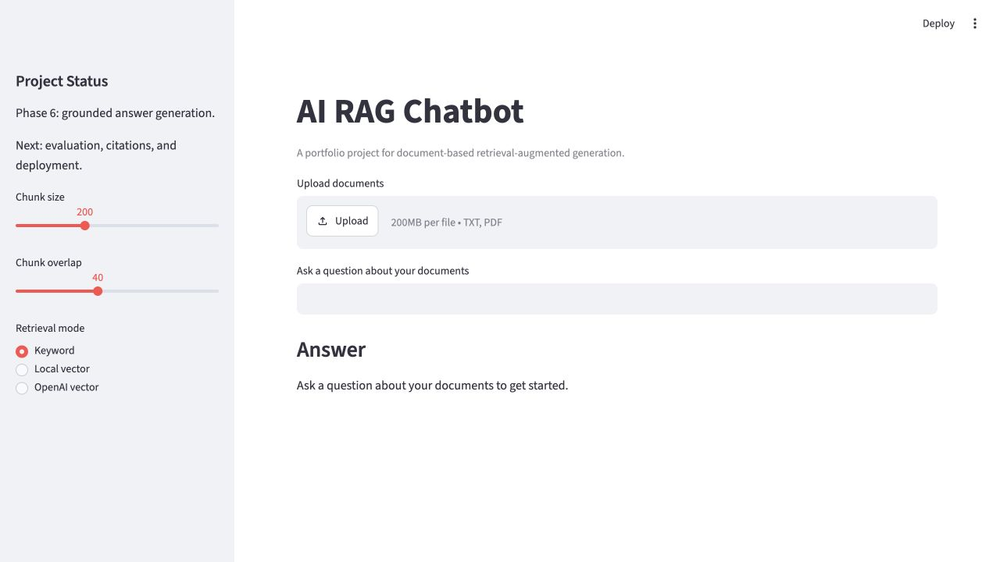

# AI RAG Chatbot

[](https://github.com/Tony-QianxiLU/ai-rag-chatbot/actions/workflows/ci.yml)
[](https://github.com/Tony-QianxiLU/ai-rag-chatbot/releases)
[](https://www.python.org/)

A document-based chatbot that will use embeddings, vector search, and LLM responses to answer questions from uploaded documents.

This repository is part of my AI engineering portfolio. The goal is to build the project incrementally, with clear documentation, professional Git workflow, and code that I can explain in interviews.

## Live Demo

[Open the deployed Streamlit app](https://ry84fwqnk4abfhufqkhrmz.streamlit.app/)

## Screenshot



## Current Status

Phase 7: portfolio-ready RAG prototype.

The current version focuses on:

- Clean Python project structure
- Reproducible environment with `uv`
- Streamlit user interface
- RAG pipeline interfaces
- `.txt` and `.pdf` upload support
- Text extraction and document preview
- Configurable text chunking with overlap
- Deterministic keyword retrieval over chunks
- Chroma vector storage
- Local deterministic embeddings for development
- Optional OpenAI embeddings through environment configuration
- Grounded answer generation interface
- Offline template answers when no API key is configured
- Optional OpenAI answer generation
- Source citations with chunk id, score, and preview
- Retrieval evaluation helpers
- GitHub Actions CI
- Deployment notes
- Tests for core project behavior
- Clear roadmap toward production-quality RAG

## Planned Architecture

```text
User uploads documents
        |
        v
Document loader and chunker
        |
        v
Embedding model
        |
        v
Vector database
        |
        v
Retriever
        |
        v
LLM response generation
        |
        v
Answer with cited context
```

## Tech Stack

- Python 3.12
- Streamlit
- LangChain
- OpenAI API
- Chroma
- pytest
- uv

## Project Structure

```text
ai-rag-chatbot/
├── src/
│   └── ai_rag_chatbot/
│       ├── __init__.py
│       ├── app.py
│       ├── config.py
│       └── rag.py
├── tests/
│   └── test_rag.py
├── docs/
│   └── architecture.md
├── .env.example
├── .gitignore
├── pyproject.toml
└── README.md
```

## Getting Started

Install dependencies:

```bash
uv sync
```

Run the app:

```bash
uv run streamlit run src/ai_rag_chatbot/app.py
```

Run tests:

```bash
uv run pytest
```

## Demo Walkthrough

See [docs/walkthrough.md](docs/walkthrough.md) for a suggested interview demo script.

## Environment Variables

Create a local `.env` file from `.env.example`:

```bash
cp .env.example .env
```

Never commit real API keys.

## Roadmap

- [x] Create professional project skeleton
- [x] Add Streamlit prototype UI
- [x] Add testable RAG pipeline placeholder
- [x] Add document upload and parsing
- [x] Add text chunking
- [x] Add local retrieval over chunks
- [x] Add embeddings interface
- [x] Add Chroma vector storage
- [x] Add answer generation interface
- [x] Add optional OpenAI response generation
- [x] Add source citations
- [x] Add evaluation examples
- [x] Add CI workflow
- [x] Add deployment notes
- [x] Deploy public demo

## Interview Talking Points

This project is designed to demonstrate:

- Understanding of RAG architecture
- Ability to structure Python applications professionally
- Practical use of LLM APIs and vector databases
- Awareness of environment variables and secret management
- Clear documentation and incremental delivery
