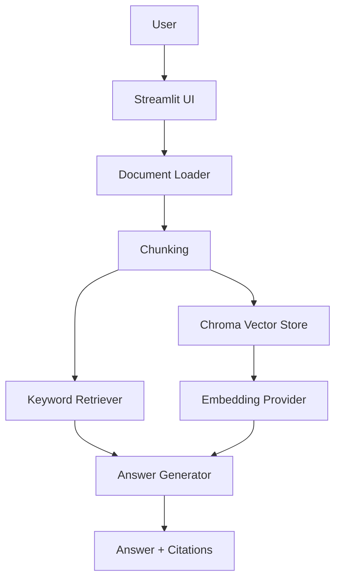
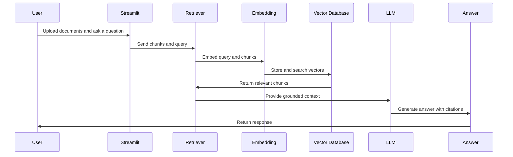

# Architecture

## Goal

AI RAG Chatbot is a document-grounded question-answering application. It is built to be simple enough to explain in interviews and structured enough to extend toward production RAG systems.

## System Diagram

## RAG Pipeline

## Components

| Component | Responsibility |
| --- | --- |
| `app.py` | Streamlit interface and user workflow. |
| `document_loader.py` | `.txt` and `.pdf` extraction with input validation. |
| `chunking.py` | Word-based chunking with overlap. |
| `retrieval.py` | Deterministic keyword retrieval. |
| `embeddings.py` | Local hash embeddings and optional OpenAI embeddings. |
| `vector_store.py` | Chroma persistence and vector retrieval. |
| `generation.py` | Template fallback and optional OpenAI answer generation. |
| `rag.py` | Pipeline orchestration and structured response objects. |
| `evaluation.py` | Retrieval evaluation helpers. |

## Design Decisions

- Deterministic local fallbacks keep the project demoable without paid API keys.
- OpenAI integrations are optional and configured only through environment variables.
- Citations are first-class response objects so the UI can show source, chunk id, score, and preview.
- Vector retrieval uses replace semantics in the demo app to avoid stale uploaded-document state.
- Tests focus on deterministic behavior, not external API calls.
